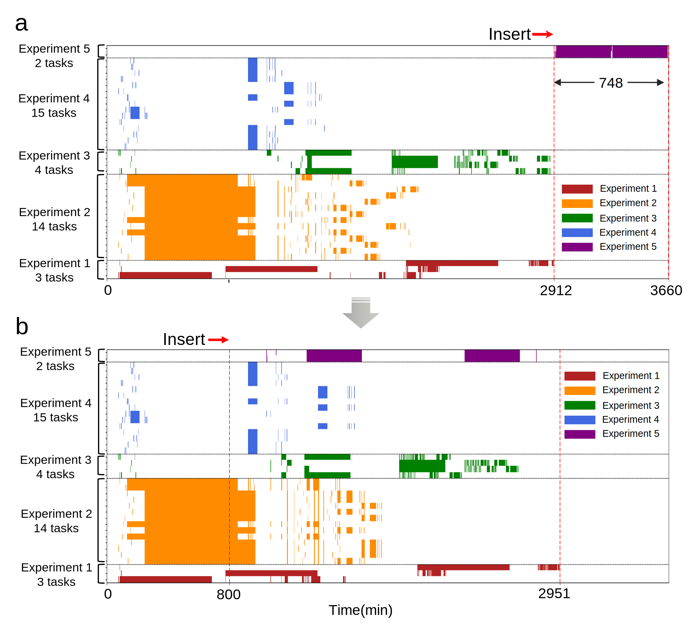

# Multi-robot-multi-task scheduling module

This repository contains the code for the multi-robot-multi-task scheduling module. The file structure is as follows:


## Directory tree
> + simulaton 
>   + Code folder for generate simulation result in paper
> + real_scheduling
>   + Code folder for real scheduling
> + README.md

The core algorithm code for multi-task scheduling can be found in [fespb.py](https://github.com/speedzjy/multi-robot-multi-task_scheduling/blob/main/real_scheduling/fespb/fespb.py). The code [multi_robot_multi_task_scheduling.py](https://github.com/speedzjy/multi-robot-multi-task_scheduling/blob/main/real_scheduling/scheduling_new.py) integrates the scheduling results of the FESP-B algorithm and considers the lab status for the scheduling of robots and stations, thus forming the multi-robot-multi-task scheduling module.

The simulation part of the code is essentially similar to the real_scheduling part, except that the simulation part additionally provides simulation examples in the paper.

## Simulation

### 1. Directly visualize the results of the paper.

#### (1) Multi-robot-multi-task scheduling tables for four simulation experimental tasks using 2 mobile robots
```python
python draw_schedule_comp_4_exprs.py --num_robot 2
```


#### (2) Simulated scenarios of using 1 to 5 robots to automate the four simulation experiments
change num_robot from 1 to 5
```python
python draw_schedule_comp_4_exprs.py --num_robot 1
```

#### (3) Dynamic rescheduling upon insertion of new tasks
```python
python draw_schedule_dynamic_insert.py
```



#### (4) Essential total duration of the four simulation experiments
```python
python draw_schedule_no_transfer_time.py
```


### 2. Indirectly reproduce the results of the paper.

(1) Select an example from [examples](https://github.com/speedzjy/multi-robot-multi-task_scheduling/tree/main/simulation/examples).

(2) In [send_task_sim.py](https://github.com/speedzjy/multi-robot-multi-task_scheduling/blob/main/simulation/send_task_sim.py), modify the file reading path to the example selected in (1).

(3) In [scheduling.py](https://github.com/speedzjy/multi-robot-multi-task_scheduling/blob/main/simulation/scheduling.py), modify the save path of the scheduling table database.

(4) Run the two scripts:

`python send_task_sim.py`

`python scheduling.py --debug`

(5) Save the scheduling table.(xx.sqlite)

Repeat the above 5 steps to obtain the scheduling tables for all files except 5_experiments.json.

(6) Generate the scheduling table for 5_experiments.json.
- Modify the file reading path in [send_task_sim.py](https://github.com/speedzjy/multi-robot-multi-task_scheduling/blob/main/simulation/send_task_sim.py) to 4_experiments.json.
- In [scheduling.py](https://github.com/speedzjy/multi-robot-multi-task_scheduling/blob/main/simulation/scheduling.py), modify the save path of the scheduling table database.
- Run the two scripts:

  - `python send_task_sim.py`

  - `python scheduling.py --debug`

- Exit [send_task_sim.py](https://github.com/speedzjy/multi-robot-multi-task_scheduling/blob/main/simulation/send_task_sim.py) while holding [scheduling.py](https://github.com/speedzjy/multi-robot-multi-task_scheduling/blob/main/simulation/scheduling.py) after waiting for scheduling.py to output the scheduling results.

- Modify the file reading path in [send_task_sim.py](https://github.com/speedzjy/multi-robot-multi-task_scheduling/blob/main/simulation/send_task_sim.py) to 5_experiments.json.

- Run the script:

  - `python send_task_sim.py`

- Wait for [scheduling.py](https://github.com/speedzjy/multi-robot-multi-task_scheduling/blob/main/simulation/scheduling.py) to output the scheduling results again to obtain the dynamic insertion results.

- At this point, all simulation scheduling tables have been generated. The steps in section 1 can be repeated to obtain the simulation figures.
